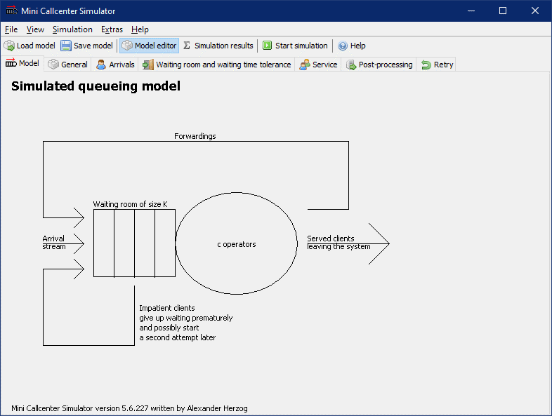

# Mini Callcenter Simulator

([Deutsche Version dieser Readme.](README_de.md))

In many cases, personnel planning is carried out in call centers based on the Erlang-C formula. However, the Erlang-C formula does not take into account many of the characteristics of real call center systems that are important for the performance variables. In the classic formulation, the Erlang C formula does not take into account either wait cancellers or repeaters. There is an extended variant of the Erlang-C formula that includes at least the wait cancellers. In addition, when using the Erlang-C formula, it is assumed that both the service times and the waiting time tolerances of the clients are exponentially distributed.

The Mini Call Center Simulator simulates a call center and takes into account exactly the above mentioned characteristics. When displaying the results, the simulation results are also compared to the Erlang-C results and it is indicated which properties of the system lead to deviations between simulation and formula results.

The Mini Call Center Simulator is mainly used for teaching purposes. In the Mini Callcenter Simulator different distributions for inter-arrival times, service times, etc. can be entered and the relevant properties "customer impatience" and "repeated tries" are also modeled, but neither different customer groups and skills of the agents nor an arrival rate that changes during the day are modeled. These and many other properties are available in the large call center simulator.

## Download

* [Windows installer](https://github.com/A-Herzog/Mini-Callcenter-Simulator/releases/latest/download/MiniCallcenterSimulatorSetup.exe)
* [Zip file](https://github.com/A-Herzog/Mini-Callcenter-Simulator/releases/latest/download/MiniCallcenterSimulator.zip) (for use under Windows, Linux, MacOS, ...)
* [Source code](https://github.com/A-Herzog/Mini-Callcenter-Simulator/releases/latest/) ([Notes on the build process](BUILD.md))

The Windows version can be installed with or without admin rights. The zip file version can be used on any platform without installation.

* System requirements: [Java 11 or higher](https://adoptopenjdk.net/ "Download Java from adoptopenjdk.net")
* License: [Apache License 2.0](https://opensource.org/licenses/Apache-2.0) (for Mini Callcenter Simulator, the used libraries are partly subject to different open source licenses)

## Literature (in German)

[A. Herzog: "Callcenter – Analyse und Management"](https://www.springer.com/de/book/9783658183080)  (in German)

Citing "Callcenter – Analyse und Management" using BibTeX:

    @book{herzog2017callcenter,
      title={Callcenter--Analyse und Management},
      author={Herzog, Alexander},
      year={2017},
      publisher={Springer}
    }
