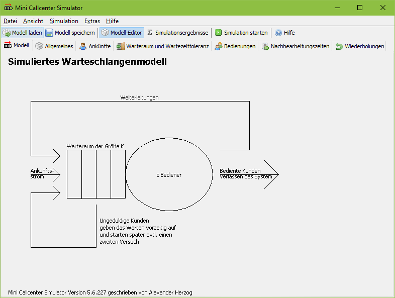

# Mini Callcenter Simulator

([English version of this readme.](README_en.md))

Vielfach erfolgt die Personalbedarfsplanung in Callcentern basierend auf der Erlang-C-Formel. In der Erlang-C-Formel bleiben jedoch viele Eigenschaften realer Callcenter Systeme, die maßgeblich für die Leistungsgrößen sind, unberücksichtigt. In der klassischen Formulierung berücksichtigt die Erlang-C-Formel weder Warteabbrecher noch Wiederholer. Es existiert eine erweiterte Variante der Erlang-C-Formel, in die zumindest die Warteabbrecher eingehen. Des Weiteren wird bei der Verwendung der Erlang-C-Formel davon ausgegangen, dass sowohl die Bedienzeiten als auch die Wartezeittoleranzen der Kunden exponentialverteilt sind, was in der Realität ebenfalls äußerst selten der Fall sein dürfte.

Der Mini Callcenter Simulator bildet ein Callcenter nach und berücksichtigt dabei genau die oben angeführten Eigenschaften. Bei der Anzeige der Ergebnisse werden die Simulationsergebnisse außerdem den Erlang-C-Ergebnissen gegenüber gestellt und es wird angegeben, welche Eigenschaften des Systems zu Abweichungen zwischen Simulations- und Formel-Ergebnissen führen.

Der Mini Callcenter Simulator dient im Wesentlichen zu Lehrzwecken. Im Mini Callcenter Simulator können zwar verschiedene Verteilungen für Zwischenankunftszeiten, Bedienzeiten, usw. hinterlegt werden und es werden auch die maßgeblichen Eigenschaften "Ungeduld der Kunden" und "Wiederholte Versuche" abgebildet, jedoch werden weder verschiedene Kundengruppen und Skills der Agenten sowie eine sich im Laufe des Tages ändernde Ankunftsrate abgebildet. Diese und viele weitere Eigenschaften stehen im großen Callcenter Simulator zur Verfügung.

## Download

* [Windows-Installer](https://github.com/A-Herzog/Mini-Callcenter-Simulator/releases/latest/download/MiniCallcenterSimulatorSetup.exe)
* [zip-Datei](https://github.com/A-Herzog/Mini-Callcenter-Simulator/releases/latest/download/MiniCallcenterSimulator.zip) (nutzbar unter Windows, Linux, MacOS, ...)
* [Quellcode](https://github.com/A-Herzog/Mini-Callcenter-Simulator/releases/latest/) ([Hinweise zum Build-Prozess](BUILD.md))

Die Windows-Version kann sowohl mit als auch ohne Admin-Rechte installiert werden. Die zip-Datei-Variante kann auf jeder Plattform ohne Installation verwendet werden.

* Systemvoraussetzung: [Java 8 oder höher](https://adoptopenjdk.net/ "Java von adoptopenjdk.net herunterladen")
* Lizenz: [Apache License 2.0](https://opensource.org/licenses/Apache-2.0) (für den Mini Callcenter Simulator, die verwendeten Bibliotheken unterliegen zum Teil abweichenden Opensource-Lizenzen)

## Literatur

[A. Herzog: "Callcenter – Analyse und Management"](https://www.springer.com/de/book/9783658183080)

"Callcenter – Analyse und Management" mit BibTeX zitieren:

    @book{herzog2017callcenter,
      title={Callcenter--Analyse und Management},
      author={Herzog, Alexander},
      year={2017},
      publisher={Springer}
    }